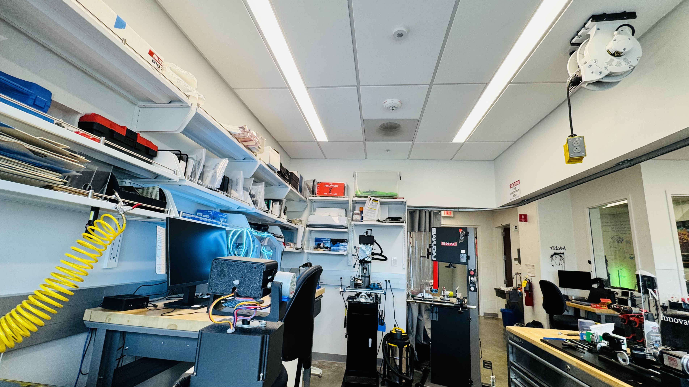

# Hyperspectral Results

Our device utilizes independent pan and roll stepper motors with a resolution of 2048 steps per revolution. An internal servo-controlled shutter enables in-place black point correction every 30s.

## Scanning Results

The HOSI device was used to create a 137 x 91 hyperspectral data by panning 120° and rolling 80° at 1° increments.

Within the GUI, each x-y 'pixel' can be clicked to reveal the full spectrum (320–880 nm) with reporting for radiance and luminance. Once clicked, the spectrum is displayed for that pixel and the peak will be automatically plotted (red arrow). Clicking other points on the plot will draw a vertical line and present data for that wavelength.

**Exported RGB Image**

**Actual Scene (from iPhone)**

**Blue LED Strip in View**

## Conclusion

In conclusion, our device captures spectral data for an entire scene which can be analyzed in realtime or posthoc; all data is exported via CSV as well as the RGB image below.